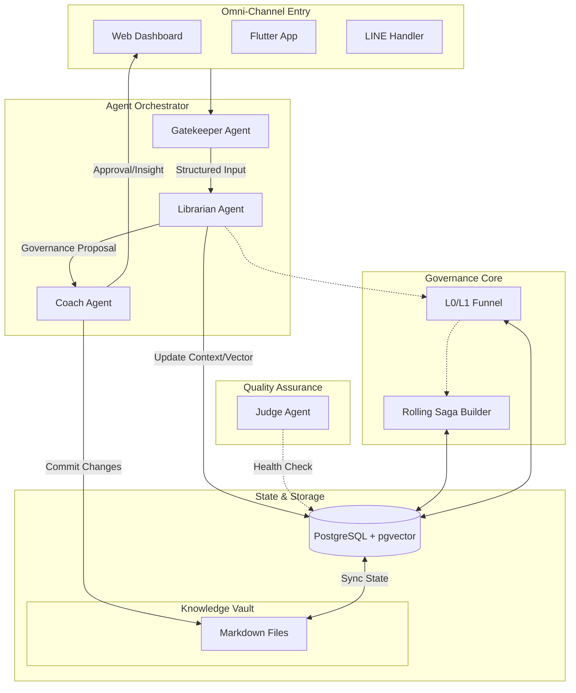

# Zentropy Technical Blueprint (全域技術藍圖)

本文件定義了 Zentropy 系統跨平台的實作架構、技術棧與測試策略。

## 1. 技術棧 (Tech Stack)
*   **Backend**: Python 3.10+ & FastAPI (異步、高性能)。
*   **Persistence**: PostgreSQL 16+ (Relational Data, JSONB).
*   **Vector Search**: pgvector Extension (L0 Funnel & Semantic Search).
*   **ORM**: SQLAlchemy 2.0+ (Async).
*   **Web POC**: Next.js 14+ (App Router), React 18+, Tailwind CSS, Prisma ORM
*   **Mobile App**: Flutter (REST API Client).
*   **LLM**: Gemini 2.5 Flash Lite (核心 NLU 引擎，透過 @ai-sdk/google 整合).
*   **AI SDK**: Vercel AI SDK (`ai` package) + Zod Schema 驗證.

## 2. 目錄結構 (Directory Structure) - Clean Arch 實踐

### 2.1 Backend (Python)
`backend/app/`
*   `domain/`: Entities (純數據模型) & Interfaces (定義 Repository/Service 接口)。
*   `application/`: Use Cases (業務流程邏輯) & DTOs。
*   `infrastructure/`: Firestore 實作、LLM API 實作、外部服務。
*   `interface/`: FastAPI Routes, Middleware。

### 2.2 Mobile (Flutter)
`app/lib/src/`
*   `domain/`: 核心業務模型與抽象介面。
*   `application/`: BLoC / Provider / Riverpod 邏輯層。
*   `infrastructure/`: API Client, Firebase 插件封裝。
*   `presentation/`: Widget UI 層。

## 3. 測試策略 (Testing Strategy - TDD First)

### 3.1 單元測試 (Unit Tests)
*   **目標**: 100% 覆蓋 `domain` 與 `application` 層。
*   **原則**: 不依賴外部網路與數據庫。使用 Mock 分離 Infrastructure。
*   **流程**: 撰寫失敗測試 -> 實作 Domain 邏輯 -> 通過測試。

### 3.2 整合測試 (Integration Tests)
*   **目標**: 驗證 FastAPI 到 Firestore、或是 Gatekeeper 到 Librarian 的鏈接。
*   **時機**: 每個功能 Task 完成後執行。

## 4. 數據模型與 Firestore 映射
(未來在此定義具體的 Collection 結構：Inputs, Users, Entities, etc.)

## 5. System Architecture Diagram

以下架構圖展示了各元件的交互流向，特別強調了 **Agent 協作鏈** 與 **治理閉環 (Governance Loop)**：

## 6. Core Services Architecture & Governance Scalability

#### 5.1 Backend Service Layer (FastAPI)
The backend is structured around domain-driven services:

- **CoachService**: Aggregates data for the Coach Agent's dashboard.
- **LibrarianService**:
    - **Responsibility**: Handles "Semantic Refactoring" and "Knowledge Governance".
    - **Scalability & Cost Control (The Governance Funnel)**: To prevent Token explosion and high latency as user data grows, Librarian uses a 3-layer filter before invoking LLM:
        - **L0: Vector Pre-filtering (PostgreSQL + pgvector)**:
            - Instead of feeding all data, system calculates Cosine Similarity between incoming `Trivial Tasks` and existing `Active Entities`.
            - Only entities with similarity score > 0.6 are retrieved as candidates.
            - *Cost*: Negligible (Matrix Math).
        - **L1: Context Sliding Window**:
            - For identified candidate entities, do NOT load full history. Load only the `Current Narrative Summary` + `Last 5 Mutations`.
            - Historical details are compressed into the summary during previous refactoring cycles.
        - **L2: Incremental Batching**:
            - Governance runs as a background cron job (e.g., daily at 4 AM).
            - Processing small batches (10-20 items) daily is significantly cheaper and more accurate than monthly bulk processing.
    - **LLM Interaction**: Only after L0/L1 filtering, the condensed context is sent to Gemini for high-level reasoning (Gravity/Entropy checks).

- **VectorAnalyticsService**: 
    - Manages embeddings generation and vector search.
    - Providing relevance scores for context retrieval.

## 7. Agent Session Lifecycle & Long-Term Memory Modes

### 7.1 Long-Term Memory Mode Flag

- Environment flag: `LONG_TERM_MEMORY_MODE=off|each_turn|idle_flush_30m`
- Default: `off`
- Purpose: control whether the LINE / REST agent writes short-term conversations into long-term memory.

Mode semantics:

1. `off`
   - Do not write any agent conversation into long-term memory.
   - Memory retrieval is also disabled for agent conversations.

2. `each_turn`
   - Preserve the existing per-turn memory pipeline.
   - After each successful agent reply, the current user / assistant turn may be written into long-term memory.

3. `idle_flush_30m`
   - Do not write long-term memory on every turn.
   - Only when a new message arrives and the session has been idle for at least 30 minutes, the previous session segment is flushed once into long-term memory, then the short-term session context is reset.

### 7.2 Idle Flush Trigger Contract

For `idle_flush_30m`, the system must evaluate idle state before processing the incoming message:

- Input: `beforeMessage(sessionId, userId, now)`
- Idle condition: `now - last_activity_at >= 30 minutes`
- `last_activity_at` is owned by the session lifecycle layer, not by the LLM framework.
- The first message of a new session must not trigger flush.

Flush scope:

- Flush only the existing short-term context of that `sessionId`
- Includes:
  - stored session history
  - stored compressed summary
- Excludes:
  - the newly arrived user input that triggered the idle check

### 7.3 Reset, Fallback, and Concurrency Semantics

Reset behavior:

- After a successful idle flush, the system must:
  - clear session history
  - clear compressed summary
  - advance the session segment marker

Failure fallback:

- Flush runs as a background-capable application workflow and must not block the current user reply.
- If flush fails:
  - the current reply still proceeds
  - the previous short-term context must not be reset
  - the failure must be logged for observability

Concurrency and idempotency:

- Same `sessionId` flush must be protected by a process-local mutex.
- Architecture must preserve a clean extension point for a future distributed lock.
- Same session segment must be flushed at most once.
- The lifecycle layer must record a flush marker / sequence id so concurrent messages do not duplicate the flush.

### 7.4 Store Ownership

- Session timeout judgement must not depend on LLM internals.
- Session lifecycle metadata must be stored in a dedicated metadata-capable store.
- Initial implementation may be in-memory.
- The interface must remain portable to Redis or another shared store later.

### 7.5 Agent Primary Model Provider Compatibility Contract

- The agent primary chat model is provider-configurable through a centralized adapter layer.
- Replacing the primary provider/model must not assume tool-calling compatibility is identical across vendors.
- A passing agent baseline means the delivered product behavior is acceptable under the current orchestration, not that the provider is a drop-in protocol-equivalent replacement.

Runtime switches:

- `AGENT_PRIMARY_PROVIDER=groq|gemini`
- `AGENT_ROUTING_MODE=provider_default|tool_first`

Switch semantics:

1. `AGENT_PRIMARY_PROVIDER`
   - Selects the primary provider used by the agent chat model and summary model.
   - The adapter layer owns provider-specific client initialization, model name defaults, and API path compatibility.

2. `AGENT_ROUTING_MODE`
   - `provider_default`: let the underlying model/tool stack handle normal tool routing.
   - `tool_first`: run deterministic routing for high-confidence skill paths before falling back to the primary model.
   - This flag is intentionally independent from provider choice because provider and routing strategy are separate concerns.

Current production-oriented compatibility notes:

1. Groq `meta-llama/llama-4-scout-17b-16e-instruct`
   - Used as the agent primary chat model through an OpenAI-compatible adapter.
   - Must use chat-completions style calls, not the AI SDK default OpenAI `/responses` path.
   - In current validation, native function-calling parameter generation is not fully reliable for the Zentropy agent tool set.
   - Therefore the agent relies on deterministic tool-first routing for high-confidence skill paths such as:
     - brain dump
     - task query
     - complete task search
     - adjust tags
     - reorganize preview

2. Gemini reversion semantics
   - Switching the centralized model adapter back to Gemini is expected to remain compatible with the current orchestration.
   - However, the routing mode is controlled independently.
   - Therefore "switch back to Gemini" means restoring Gemini as the primary model provider under the current routing architecture selected by `AGENT_ROUTING_MODE`.

Engineering implication:

- Provider replacement must be validated at two levels:
  - product-level behavior (baseline / gate)
  - provider-level protocol assumptions (tool calling, message format, error modes, latency, fallback behavior)
